# 矛盾纠纷管理系统项目说明

本文档用于说明当前小程序的整体业务逻辑、角色分工、页面流转、云函数职责、数据结构和后续优化方向。它偏向“看懂项目”和“讲清项目”，不是接口文档或开发规范；开发规范请看根目录 `AGENTS.md`。

## 1. 项目定位

本项目是一个基于 `uni-app + Vue 3 + Pinia + uniCloud` 的微信小程序，用于基层矛盾纠纷的录入、分派、回访、跟踪和管理。

系统围绕一个核心业务目标展开：让纠纷从发现到处理形成闭环，并且让每一步都有角色负责、有数据记录、有状态可追踪。

核心流程可以概括为：

```text
发现纠纷 -> 派出所/工作人员录入 -> 街道分派 -> 社区回访处理 -> 状态更新 -> 日志留痕
```

## 2. 技术架构总览

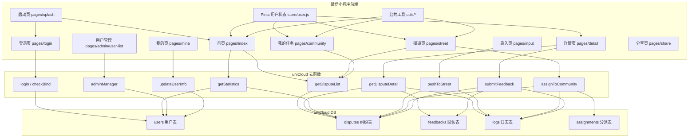

## 3. 角色与权限

系统目前主要有四类角色：派出所、街道、社区、管理员。用户可以拥有多个授权角色，并在“我的”页面切换当前角色。

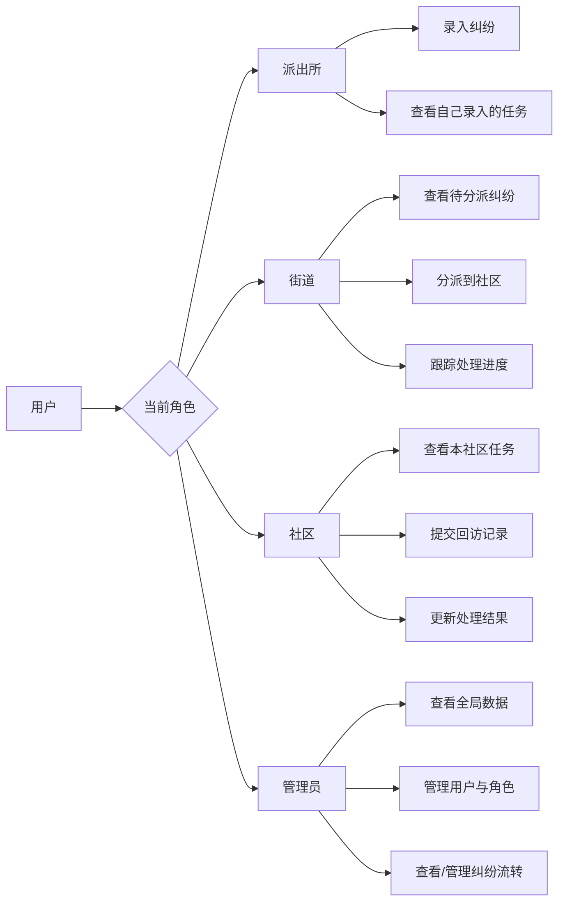

角色职责说明：

| 角色 | 主要页面 | 核心职责 |
| --- | --- | --- |
| 派出所 | 首页、录入、我的任务 | 录入纠纷，查看后续流转进度 |
| 街道 | 街道页、我的任务、录入 | 接收待分派纠纷，分派给社区 |
| 社区 | 我的任务、详情页 | 处理本社区任务，提交回访 |
| 管理员 | 首页、街道、用户管理、我的任务、录入 | 管理用户、角色、全局任务 |

## 4. 登录与启动逻辑

小程序打开后先进入启动页，启动页判断本地是否有用户缓存。如果本地缓存可用，就直接进入对应角色首页；如果没有缓存，就调用微信登录和 `checkBind` 云函数判断是否已经绑定手机号。

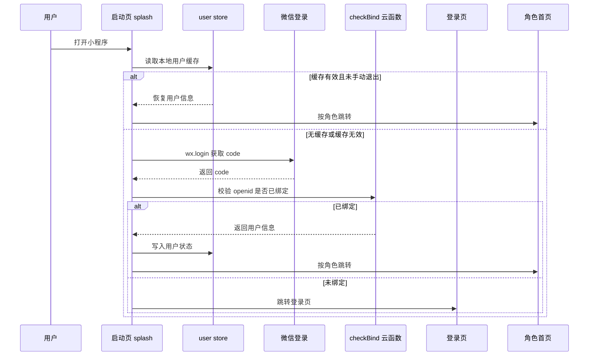

首次登录绑定流程：

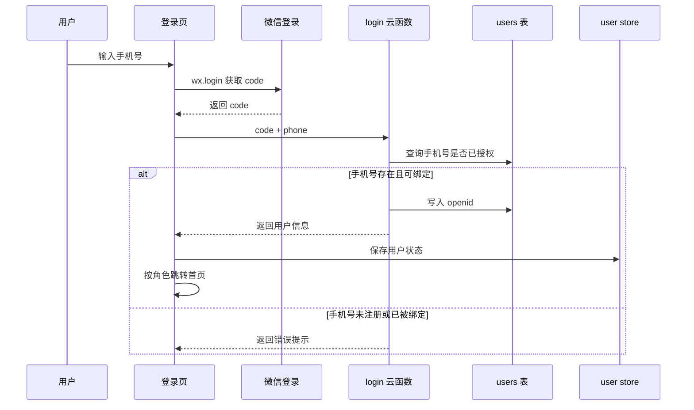

## 5. 纠纷流转主流程

纠纷的生命周期是系统最核心的业务逻辑。

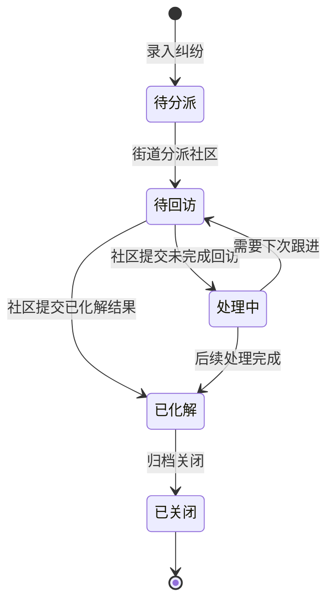

业务步骤说明：

1. 工作人员在录入页填写纠纷来源、社区、标题、描述、位置、涉及人员、风险等级等信息。
2. 前端调用 `pushToStreet` 云函数，将记录写入 `disputes` 表。
3. 新增纠纷默认状态为 `待分派`。
4. 街道角色进入街道页，查看待分派列表。
5. 街道选择社区并调用 `assignToCommunity`。
6. 系统更新纠纷的 `assign_community`，状态变为 `待回访`。
7. 社区角色进入我的任务页，只查看分派给本社区的任务。
8. 社区在详情页提交回访，调用 `submitFeedback`。
9. 系统写入 `feedbacks`，并根据结果更新纠纷状态。

## 6. 页面地图

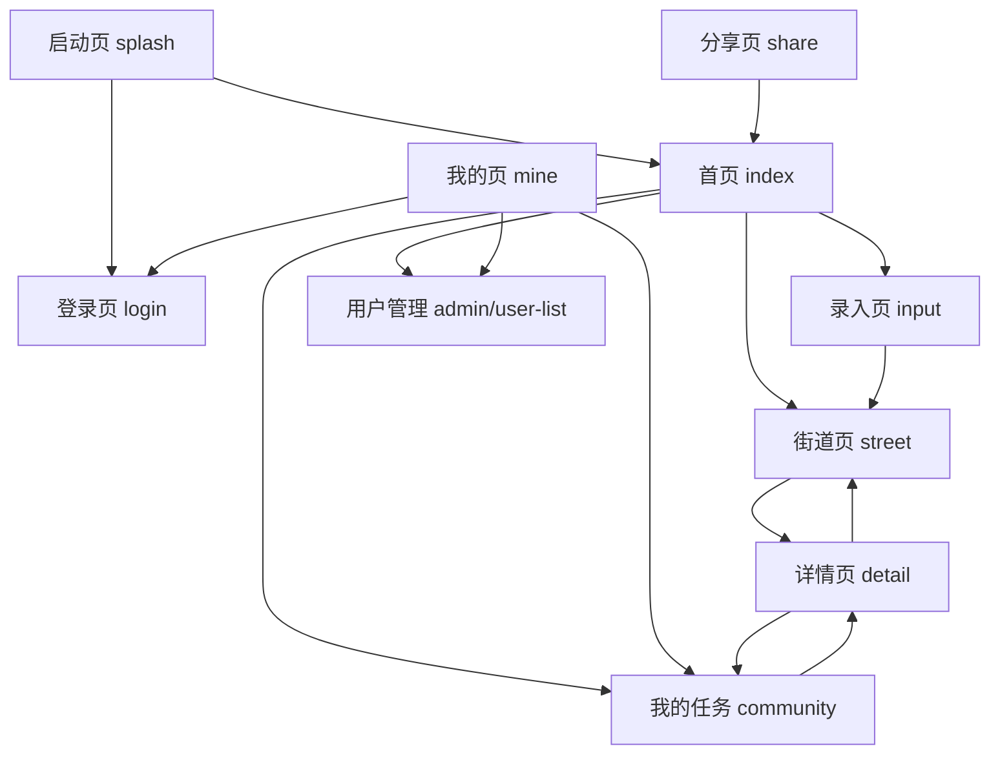

页面职责表：

| 页面 | 路径 | 职责 |
| --- | --- | --- |
| 启动页 | `pages/splash/index` | 初始化登录态，自动识别已绑定用户 |
| 登录页 | `pages/login/index` | 手机号绑定与登录 |
| 首页 | `pages/index/index` | 按角色展示统计、入口和最近任务 |
| 录入页 | `pages/input/index` | 新增纠纷并推送街道 |
| 街道页 | `pages/street/index` | 查询、筛选、分派纠纷 |
| 我的任务 | `pages/community/index` | 按角色展示可见任务 |
| 详情页 | `pages/detail/index` | 查看详情、回访记录、提交回访 |
| 我的页 | `pages/mine/index` | 头像、姓名、角色切换、账号状态 |
| 用户管理 | `pages/admin/user-list` | 管理用户、角色、社区归属 |
| 分享页 | `pages/share/index` | 统一分享落地页 |

## 7. 数据表关系

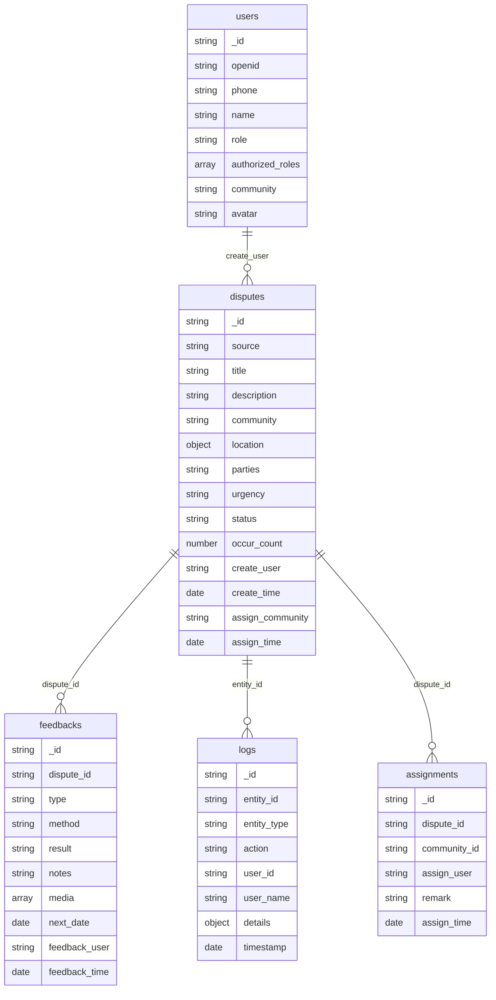

主要数据说明：

| 表 | 作用 |
| --- | --- |
| `users` | 保存授权用户、openid、手机号、角色、社区归属 |
| `disputes` | 保存纠纷主记录，是系统最核心的数据表 |
| `feedbacks` | 保存社区回访和处理记录 |
| `logs` | 保存创建、分派、回访等操作留痕 |
| `assignments` | 保存纠纷分派记录 |

## 8. 云函数职责

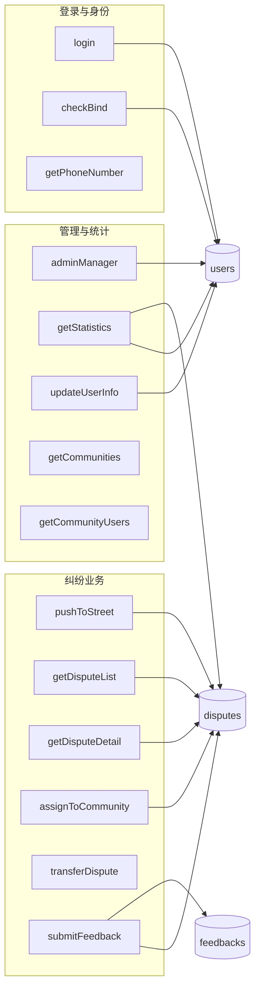

云函数说明：

| 云函数 | 主要职责 |
| --- | --- |
| `login` | 微信 code 换 openid，手机号绑定，返回用户信息 |
| `checkBind` | 启动时检查当前微信是否已绑定账号 |
| `getDisputeList` | 按角色、状态、关键词、日期查询纠纷列表 |
| `getDisputeDetail` | 查询纠纷详情、回访、日志 |
| `pushToStreet` | 新增纠纷，写入待分派记录 |
| `assignToCommunity` | 街道将纠纷分派到社区 |
| `submitFeedback` | 社区提交回访，更新纠纷状态 |
| `getStatistics` | 首页、街道页、任务页统计数据 |
| `adminManager` | 管理员新增、编辑、删除、解绑用户 |
| `updateUserInfo` | 用户修改头像和姓名 |

## 9. 缓存与加载逻辑

当前前端已经使用了短时间页面缓存，主要目标是让页面二次进入更快。

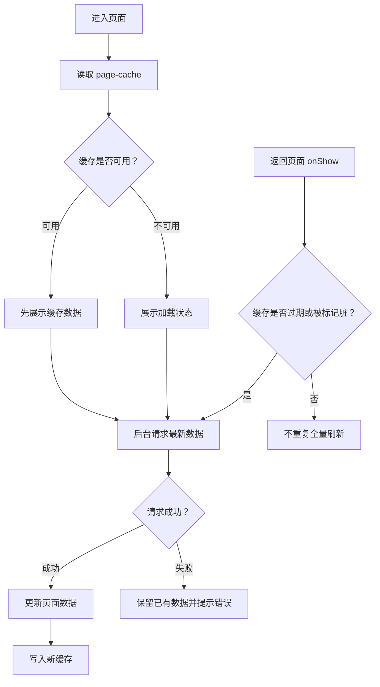

典型缓存页面：

| 页面 | 缓存内容 |
| --- | --- |
| 首页 | 统计数据、最近纠纷 |
| 街道页 | 统计数据、筛选后的纠纷列表 |
| 我的任务 | 任务统计、当前状态列表 |
| 用户管理 | 用户列表 |

## 10. 分享逻辑

项目目标是所有页面分享出去都落到统一分享页，而不是分享当前页面。

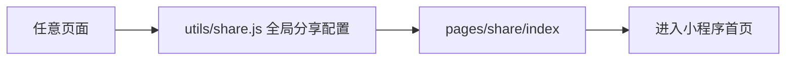

这样做的好处是：

1. 分享内容统一，避免不同页面暴露业务细节。
2. 分享封面和标题更稳定。
3. 用户从分享进入时路径更可控。

## 11. 当前项目优点

项目已经具备比较完整的业务闭环：

1. 登录、绑定、角色识别已经跑通。
2. 纠纷录入、分派、回访、状态更新形成了主流程。
3. 管理员可以维护用户和角色。
4. 主要列表已经有分页、缓存和轻量查询思路。
5. `pages.json` 中页面结构清晰，tabBar 已经回到统一配置。
6. 云函数按业务拆分，整体边界比较容易理解。
7. 已经有 `AGENTS.md` 作为后续 AI 编程规范。

## 12. 当前主要问题

这些问题不影响理解项目，但会影响后续稳定性和企业级程度。

### 12.1 权限边界还需要继续加强

部分云函数仍然较依赖前端传入的 `openid`、`role`、`community`。企业级做法应该是：

```text
前端只发业务参数 -> 云函数从上下文获取 openid -> 查询 users 表 -> 服务端判断角色和数据归属
```

特别需要优先关注：

1. `getDisputeDetail` 应按角色和社区归属限制详情可见范围。
2. `getDisputeList` 应减少对前端传入角色的信任。
3. `pushToStreet` 应校验当前用户是否有录入权限。
4. `submitFeedback` 已有社区校验，但还能继续统一成公共鉴权方法。

### 12.2 登录逻辑有重复

`login` 和 `checkBind` 都包含微信 `jscode2session` 逻辑。后续建议抽成公共方法，避免一个地方修了另一个地方忘记修。

### 12.3 查询性能还可以继续优化

列表页已经做了 `lite` 和 `needTotal: false`，这是正确方向。后续还可以继续做：

1. 用户管理分页。
2. 详情页回访和日志懒加载。
3. 搜索关键词转义和长度限制。
4. 确认数据库索引是否覆盖常用查询字段。

### 12.4 页面逻辑仍偏重

部分页面承担了较多 API 调用、缓存 key、格式化和权限判断逻辑。后续可以逐步拆到：

```text
utils/api.js
utils/format.js
utils/auth.js
utils/page-cache.js
```

不要一次性大重构，适合每次改页面时顺手拆一小块。

## 13. 后续优化路线图

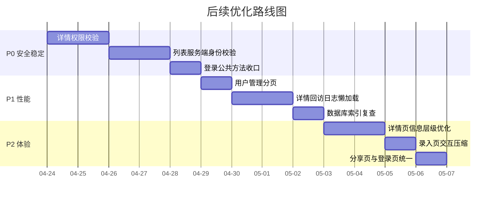

建议优先级：

| 优先级 | 事项 | 原因 |
| --- | --- | --- |
| P0 | `getDisputeDetail` 权限校验 | 防止敏感纠纷详情越权访问 |
| P0 | `getDisputeList` 服务端身份校验 | 防止前端伪造角色或社区参数 |
| P0 | 登录公共方法收口 | 减少认证逻辑重复 |
| P1 | 用户管理分页 | 用户多时明显提升加载速度 |
| P1 | 详情页懒加载 | 降低首屏请求压力 |
| P2 | 页面视觉统一 | 提升专业感和长期可维护性 |

## 14. 一句话总结

这个项目现在已经具备完整业务骨架，适合作为基层纠纷流转小程序继续打磨。下一阶段最重要的不是继续堆功能，而是把服务端权限、数据查询性能和页面结构再收紧，让它从“能跑”逐步变成“稳定、可维护、可信任”。
